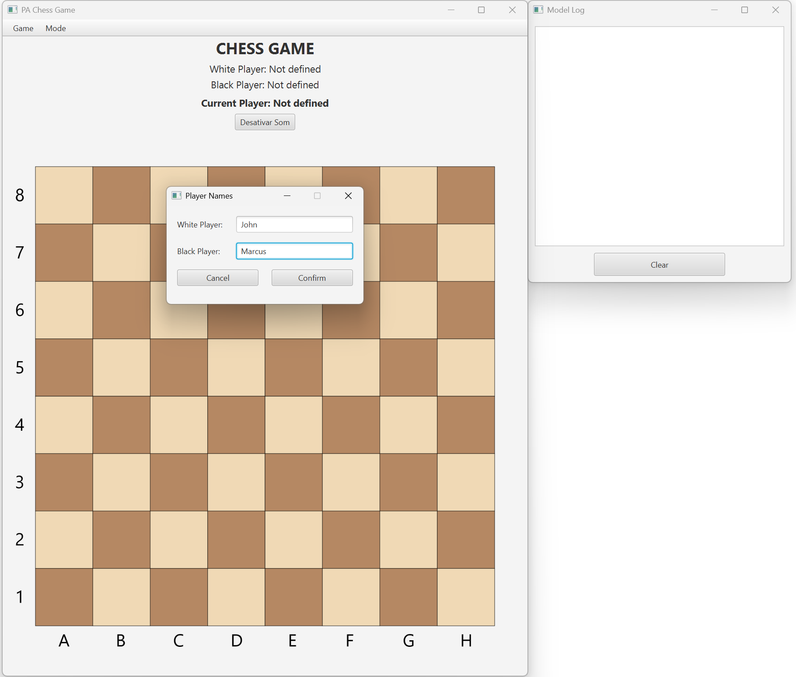
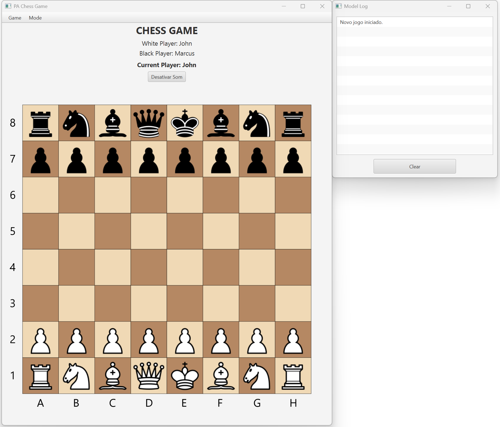
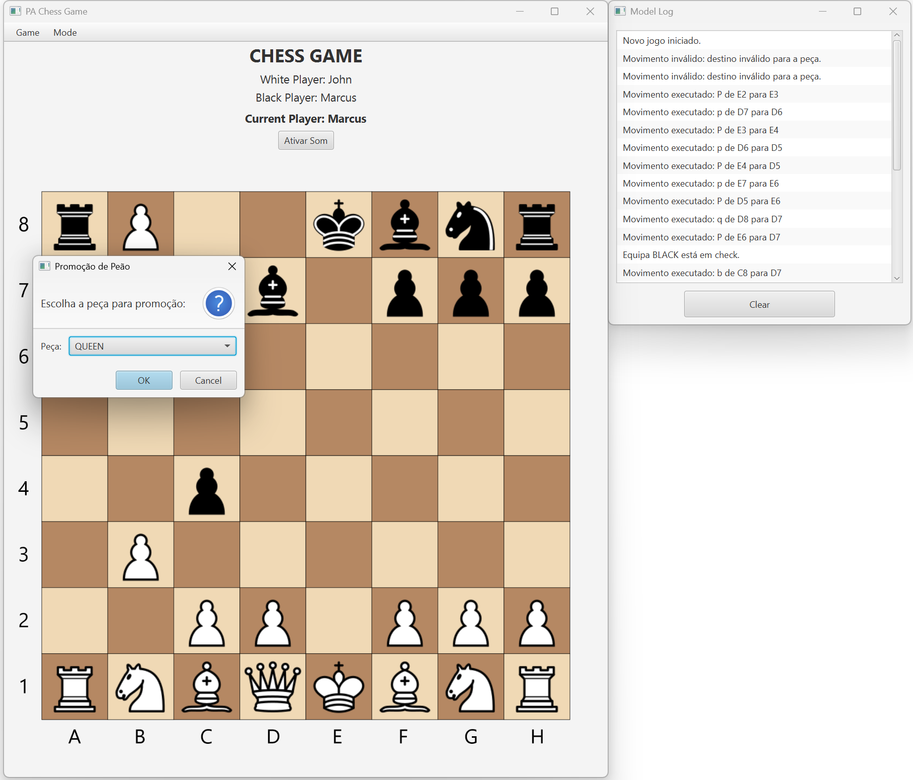

# Chess Game — JavaFX & Object-Oriented Programming

A fully functional **Chess Game** developed in **Java**, using **JavaFX - MVC@PA architectural pattern** and **Object-Oriented Programming (OOP)** principles.  
This project focuses on clean architecture, modular design and software engineering best practices such as **Facade**, **Observer**, **Factory Method**, **Memento** and **Singleton** patterns.


## Overview

The project implements a complete two-player chess game with graphical interface, following the official chess rules.  
It was developed using **JavaFX** for the GUI and adheres to **MVC@PA** (Model-View-Controller with Presenter Adapter) architecture.

Main features:
- Turn-based gameplay between two players  
- Piece movement validation and rule enforcement  
- Special moves supported (castling, en passant, pawn promotion)  
- Save and load functionality (serialization)  
- Undo and redo functionality (via **Memento pattern**)  
- Move logging and sound feedback  
- Clean separation between Model, UI and Data layers  


## Technologies Used

- **Java** – Core implementation language.  
- **JavaFX SDK 24** – Framework for building the graphical user interface.  
- **JUnit 5** – Unit testing framework ensuring code reliability.  
- **IntelliJ IDEA** – IDEs used for development and debugging.  

## Design Patterns Applied

| Pattern | Purpose |
|----------|----------|
| **Factory Method** | Creation of chess pieces dynamically (by type or textual representation) |
| **Facade** | Centralized access point to game logic (`ChessGame` and `ChessGameManager`) |
| **Memento** | Stores and restores full game states (undo/redo system) |
| **Singleton** | Global logging system (`ModelLog`) |
| **MVC@PA** | Separates data, interface, and control layers for clarity and maintainability |

## Class Overview

| Class | Description |
|--------|--------------|
| **Piece** | Represents a chess piece |
| **PieceTypeEnum** | Enum of piece types (King, Queen, Bishop, etc.) |
| **PieceTeamEnum** | Enum of teams (White / Black) |
| **Board** | Represents the chessboard and manages pieces |
| **ChessGame** | Core class managing chess rules and turns |
| **IMemento / IOriginator / Memento / Caretaker** | Manage game state saving and restoring |
| **ChessGameManager** | Facade between UI and game logic |
| **ModelLog** | Stores and displays game logs |
| **ChessGameSerialization** | Handles game saving/loading (binary format) |
| **BoardView** | Graphical representation of the board and pieces |
| **PromotionDialog** | Handles pawn promotion |
| **RootPane / TopMenuBar / AskName** | UI layout and components |
| **ModelUI** | Mediates between model and view layers |
| **ImageManager** | Loads and caches piece images |
| **SoundManager** | Controls in-game audio |
| **WinnerEnum** | Enum for possible game outcomes (White, Black, Draw) |

## User Interface

The interface was developed in **JavaFX**.  
Different panes and dialogs handle specific functions:
- **RootPane**: Central layout that organizes the main components  
- **BoardView**: Displays the chessboard and manages user interaction  
- **PromotionDialog**: Allows pawn promotion selection  
- **ModelLogPane**: Shows in-game events and errors  
- **TopMenuBar**: Access to save/load and game options  

## How to Build and Run

This project was developed using **IntelliJ IDEA** with **JavaFX** support.

1. Clone or download the repository.  
2. Open the project in **IntelliJ IDEA**.  
3. Make sure the **JavaFX SDK** is properly configured in your IDE:
   - Add the JavaFX Global Library in *Project Structure → Global  Libraries*.  
   - In *Run/Debug Configurations*, add the following VM options:  
     ```
     --module-path "path/to/javafx-sdk/lib" --add-modules javafx.controls,javafx.media
     ```
     *(Replace `path/to/javafx-sdk/lib` with the actual path where your JavaFX SDK is located)*
4. Build the project using the IDE’s build tools.  
5. Run the main class to start the game.

## Testing

The project includes a solid suite of **unit tests** built with **JUnit 5**.
### Coverage Overview
- **BoardTest** – Verifies board boundaries, valid positions and normalized text output.  
- **ChessPieceFactoryTest** – Tests dynamic piece creation using the Factory Method pattern, ensuring correct types, colors and moved state detection.  
- **ChessGameTest** – Validates move execution, checkmate detection and pawn promotion logic.

### Techniques Used
- **Parameterized Tests** with `@MethodSource` for multi-scenario coverage.  
- Assertions to confirm rule correctness and system stability.  

## Screenshots
Some screenshots of the application running.

### Initial Interface


### Gaming Interface


### Pawn Promotion Dialog

